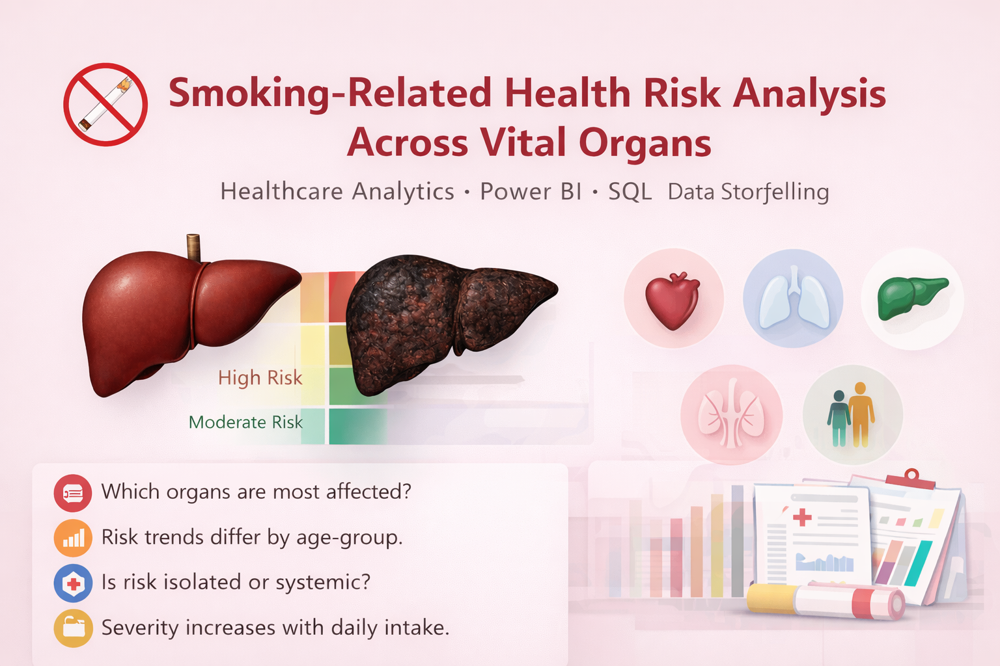

  

# 🚬 Smoking-Related Health Risk Analysis Across Vital Organs  
**Healthcare Analytics | Power BI | SQL | Data Storytelling**
## 📌 Project Overview
This project analyzes the impact of smoking on vital organs using structured healthcare data.  
The goal is to identify high-risk populations, understand organ-specific damage patterns, and translate clinical data into actionable insights that support preventive healthcare decisions.

This project intentionally bridges **biochemistry domain knowledge** with **data analytics**, demonstrating how analytical methods can support public health and clinical decision-making.

---

## 🎯 Business / Healthcare Problem
Smoking is a leading risk factor for multi-organ damage, yet risk patterns differ significantly across age, gender, duration of smoking, and lifestyle indicators.

Healthcare stakeholders need:
- Clear identification of organs most affected by smoking
- Early-risk population segmentation
- Evidence-based prioritization for screening and prevention programs

---

## 🧬 Dataset Description
The dataset contains patient-level health and lifestyle attributes, including:
- Demographics (Age, Gender)
- Smoking behavior (Status, Years of Smoking, Cigarettes per Day)
- Organ-specific health conditions
- Risk indicators (BMI, Blood Pressure, Cholesterol, Alcohol Consumption)
- Family history risk

Each record represents a simulated patient health profile suitable for analytical modeling.

---

## 🛠️ Tools & Technologies
- **SQL (MySQL)** – Data cleaning, aggregation, risk segmentation
- **Power BI** – Interactive dashboards and visual storytelling
- **Excel** – Initial data validation

---

## 🔍 Analytical Approach
1. **Data Preparation**
   - Validated categorical values and missing data
   - Normalized smoking exposure variables
   - Segmented patients by smoking intensity and duration

2. **SQL-Driven Analysis**
   - Aggregated organ damage rates among smokers vs non-smokers
   - Identified age and gender risk differentials
   - Calculated damage proportions using conditional logic
   - Structured queries using CTEs for clarity and reuse

3. **Visualization & Insight Delivery**
   - Organ-wise damage comparison
   - Smoking exposure vs health deterioration trends
   - Risk factor correlation dashboards

---

## 📊 Key Insight Questions Answered
- Which vital organs show the highest smoking-related damage rates?
- How does smoking duration impact organ health deterioration?
- Are certain age groups more vulnerable to smoking-related organ damage?
- What gender-based risk differences exist?
- How do lifestyle factors (BMI, alcohol consumption) compound smoking risks?

---

## 💡 Key Insights
- Lung and cardiovascular-related organs exhibit the highest damage prevalence among long-term smokers
- Risk increases sharply after sustained smoking duration rather than cigarette count alone
- Middle-aged populations show early but accelerating damage patterns
- Combined lifestyle risks significantly amplify smoking-related organ damage

---

## 📈 What This Analysis Enables
- Prioritization of organ-specific screening programs
- Targeted smoking cessation interventions by age group
- Data-driven public health awareness strategies
- Evidence-backed support for preventive healthcare planning

---

## 📂 Repository Structure
- `/SQL_Scripts` – Analytical queries supporting each insight
- `/PowerBI_Dashboard` – Interactive dashboard file
- `/Dataset` – Source dataset used for analysis
- `README.md` – Project documentation

---

## 🚀 Why This Project Matters
This project demonstrates how **healthcare domain knowledge combined with analytics** can translate raw patient data into meaningful, decision-ready insights — a critical skill for healthcare and life-science analytics roles.

---

## 🧬 Domain Relevance (Why This Matters)

Smoking affects the body **systemically**, not in isolation.  
By combining **biological insight** with **data analytics**, this project demonstrates:

- How **prolonged exposure** leads to cumulative organ damage
- Why **risk increases with age, duration, and daily intake**
- How smoking-related risks manifest differently across organs and genders

This mirrors **real-world healthcare analytics use cases** in:
- Preventive medicine
- Risk stratification
- Public health policy
- Clinical decision support

---

## 🗄️ Data & Tools Used

| Component | Tools |
|---------|------|
| Data Analysis | SQL (Aggregations, CASE, Window Functions) |
| Visualization | Power BI |
| Domain | Healthcare / Public Health |
| Concepts | Risk Scoring, Severity Classification, Cohort Analysis |

---

## 📂 Repository Structure 
├── PowerBI_Dashboard.pbix
├── SQL_Analysis.sql
├── Dataset/
│   └── smoking_health_data.csv
├── Images/
│   └── dashboard_screenshots.png
└── README.md

---

## 👤 Author

Munawer
🎓 MSc Biochemistry
📊 Aspiring Healthcare Data Analyst
🔗 Portfolio projects across Ecommerce, HR, and Healthcare analytics

---
## ⭐ If you find this project insightful, feel free to star the repository!
